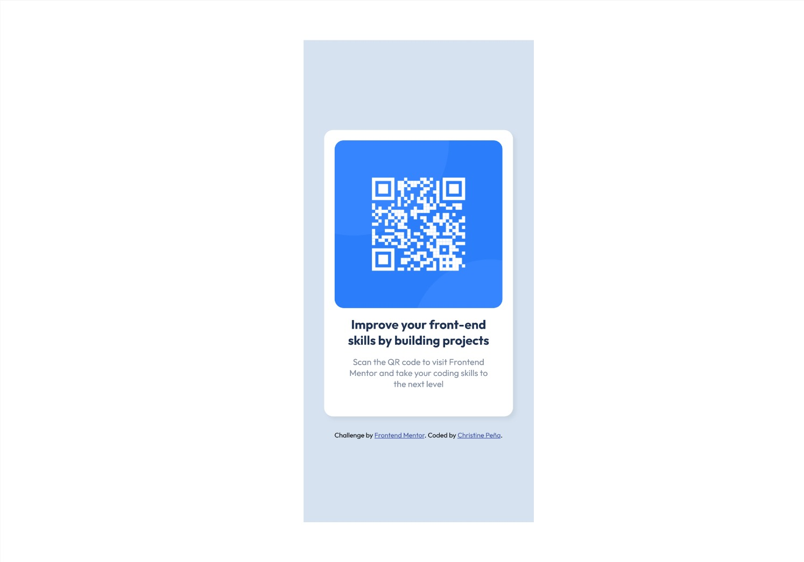
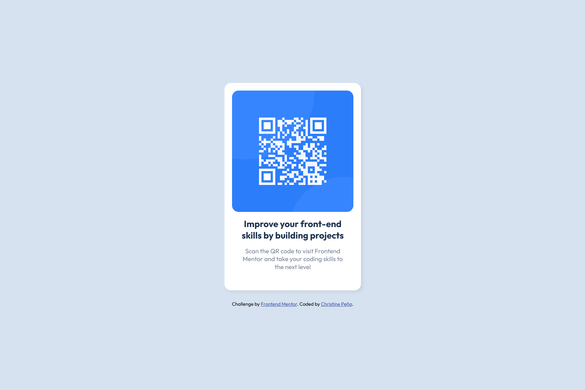

# Frontend Mentor - QR code component solution

This is a solution to the [QR code component challenge on Frontend Mentor](https://www.frontendmentor.io/challenges/qr-code-component-iux_sIO_H).

## Table of contents

- [Overview](#overview)
  - [Screenshot](#screenshot)
  - [Links](#links)
- [My process](#my-process)
  - [Built with](#built-with)
  - [What I learned](#what-i-learned)
  - [Continued development](#continued-development)
  - [Useful resources](#useful-resources)
- [Author](#author)
- [Acknowledgments](#acknowledgments)
  <br />

## Overview

### The challenge

Users should be able to:

- View the optimal layout depending on their device's screen size
- See hover and focus states for interactive elements

### Screenshot

<div align="center">
<h3>Mobile</h1>
    
<h3>Desktop</h1>

</div>

### Links

- [Solution URL](https://github.com/ChristinePena/qr-code-component-fem01.git)
- [Live Site URL](https://christinepena.github.io/qr-code-component-fem01/)
  <br />

## My process

### Built with

- Semantic HTML5 markup
- CSS Custom properties
- Flexbox
- [SASS](https://sass-lang.com/) - Maps for Breakpoint mixin
- [BEM Notation](https://getbem.com/)
- Mobile-first workflow

### What I learned

- To have a responsive card container with min() function. If the second value is the smallest, 100% of the vh minus the total space on the sides is calculated.

```scss
.card {
  width: min(u.rem(315), calc(100% - u.rem(22)));
  margin-inline: auto;
}
```

- To center the project with flex

```scss
body {
  /* center */
  display: flex;
  justify-content: center;
  align-items: center;
  /* reset */
  min-height: 100vh;
}
```

- To convert pixels to rems using a function

```scss
@function rem($pixel) {
  @if math.is-unitless($pixel) {
    @return math.div($pixel, 16) + rem;
  } @else {
    @error 'Don\'t use units when using the rem() function; only numbers.';
  }
}
```

- To self-host with @fontface (Google fonts)

```scss
@font-face {
  font-display: swap;
  font-family: "Outfit";
  font-style: normal; // italic
  font-weight: 700;
  src: local("Roboto Black"),
    url("/assets/fonts/outfit-v11-latin-700.woff2") format("woff2"), url("/assets/fonts/outfit-v11-latin-700.woff")
      format("woff");
}
```

### Continued development

- Accessible to screen reader users
- Interactive button (change qr, day/night switch)

### Useful resources

- [Min function](https://developer.mozilla.org/en-US/docs/Web/CSS/min)
- [sass:math ](https://sass-lang.com/documentation/modules/math/)
- [Self-hosting fonts](https://gwfh.mranftl.com/fonts)
  <br />
  <br />

## Author

- Frontend Mentor - [@ChristinePena](https://www.frontendmentor.io/profile/ChristinePena)
  <br />
  <br />

## Acknowledgments

- [Coder Coder](https://www.youtube.com/@TheCoderCoder)
- [Kevin Powell](https://www.youtube.com/@KevinPowell)
